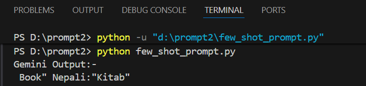

# Gemini prompt Generator

A minimal Python example that calls Google's Gemini (Generative AI) API to generate short text (example: short answer, translations, or other text completions).

## Features
- Simple example showing how to configure the `google.generativeai` client
- Uses `python-dotenv` to load the API key from a `.env` file
- Example prompt demonstrates few-shot translation formatting

## Requirements
- Python 3.8+
- The following packages:
  - `google-generativeai`
  - `python-dotenv`

Install with pip:

```bash
python -m pip install google-generativeai python-dotenv
```

## Setup

1. Create a virtual environment (recommended):

```bash
python -m venv env
env\Scripts\activate     # Windows
```

2. Create a `.env` file in the project root and add your Gemini API key using the exact variable name used in the script:

```
Gemini_API_key=your_real_api_key_here
```

Note: The script reads `Gemini_API_key` with `os.getenv("Gemini_API_key")`.

## Usage

Run the example script:

```bash
python few_shot_prompt.py
```

The script will configure the client with the key from the environment and send a prompt to the `gemini-2.5-flash` model. Output will be printed to stdout.

## Example prompt (from the script)

The example prompt included in `few_shot_prompt.py` provides a few-shot translation format, e.g.:

```
Example 1: English:"hello" Nepali:"Namaste"
Example 2: English:"Good Morning" Nepali:"Subha Prabhat"
Now translate this: English:"Book" Nepali:"
```

## Troubleshooting
- If you get authentication errors, ensure the `.env` file exists and contains a valid API key, and that you activated the virtual environment before running.
- Double-check the environment variable name: `Gemini_API_key` (case-sensitive as used in the script).

## Security
- Do not commit your `.env` or API keys to version control. Add `.env` to `.gitignore`.

## License
This example is provided as-is for learning and experimentation.

## Screenshot of Output:-

